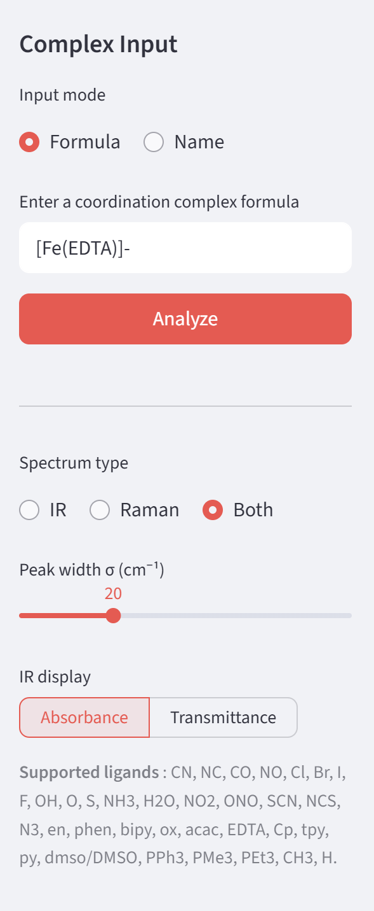
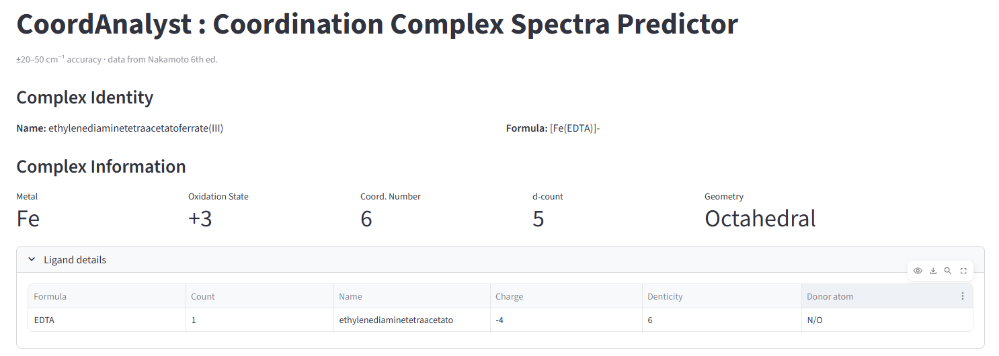
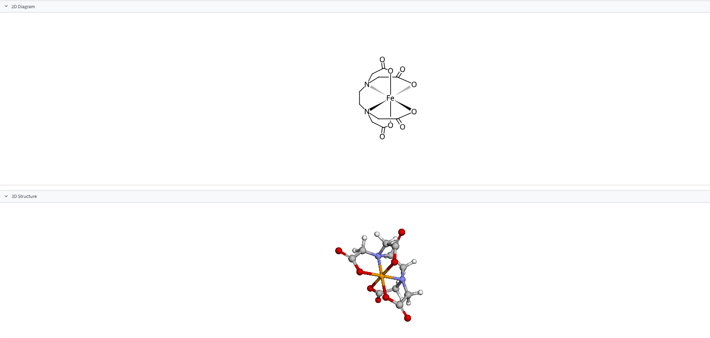
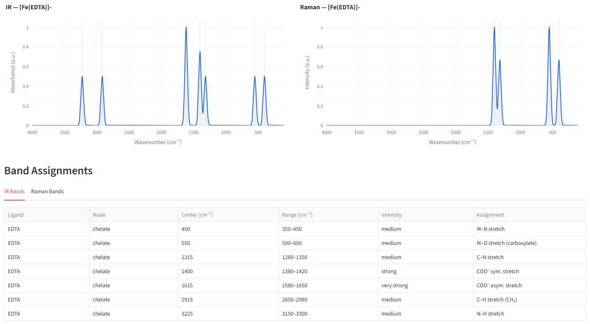

CoordAnalyst
========

## Description

### An educational tool helping students predict oxidation, geometry, number of d electrons, and other properties of a coordination complex as well as visualize it in 2D, 3D and draw a reliable IR and Raman spectra from streches in databases for common ligands.

The package CoordAnalyst aimes to analyse a wide range of coordination complexes. Indeed, the goal was to implement an educational tool to help better understand coordination chemistry by obtaining the basic informations and more. It meets a need for young chemists to have an easy-to-manipulate interface uniting all the properties of a complex they input.   
Thus, a user can enter the name or the formula of the complex on the interface to obtain its name and formula, the metal and its oxydation state, the geometry, the number of d electron and the coordination state. The list of the major common ligands that are supported is displayed, to help prevent any unknown input from the user. Furthermore, the 2D and 3D structure are displayed. For the complexes for which two different geometry can be found, both can be selected.  However, the complexes representations are qualitative and not quantitative. The goal is not to rely on the accuracy of the angles or bond length but to visualize the molecule in a global way. In addition, the package can provide Raman spectra, IR spectra or both depending on the user's preference. The width of the peaks can be selected and the transmittance style chosen. The precision of the peaks is also indicated. Finally, the data source is quoted at the bottom of the page.    
Thus, our package is a coordination complex spectra predictor that can be used as an educational tool to obtain the main properties of the complex, its IR and Raman spectra and display the complex by the 2D and 3D representations. It has value in being a lightweight tool, but its accuracy can not be expected to meet those of the result of quantum computations. 

    

## Installation

### Prerequisites

Before installing **CoordAnalyst**, make sure you have the following:

- Python 3.10 or higher
- [Anaconda](https://www.anaconda.com/download) or Miniconda (recommended)

---

### Step 1 — Clone the repository

```bash
git clone https://github.com/Carbone23400/CoordAnalyst.git
cd Project-Xplosion-Ba4
```

### Step 2 — Create a conda environment

We strongly recommend using a dedicated conda environment to avoid
dependency conflicts, particularly with RDKit.

```bash
conda create -n coordanalyst python=3.10
conda activate coordanalyst
```

### Step 3 — Install RDKit

RDKit must be installed via conda before the other dependencies,
as the pip version can cause conflicts with NumPy on some systems.

```bash
conda install -c conda-forge rdkit -y
```

### Step 4 — Install the package and its dependencies

```bash
pip install -e .
```

This installs CoordAnalyst in editable mode, meaning any changes
you make to the source code are immediately reflected without
needing to reinstall.

### Step 5 — Run the Streamlit app

```bash
python -m streamlit run App/streamlit_app.py
```

The app will open automatically in your browser at
`http://localhost:8501`.

---

### Dependencies

All Python dependencies are listed in `pyproject.toml` and installed
automatically in Step 4. The main ones are:

| Package | Purpose |
|---|---|
| `numpy` | Numerical computations |
| `matplotlib` | Plotting |
| `plotly` | Interactive spectrum plots |
| `scipy` | Signal processing |
| `requests` | PubChem API calls |
| `streamlit` | Web interface |
| `pandas` | Data tables |
| `rdkit` | 2D molecular diagrams |
| `py3Dmol` | 3D molecular viewer |

---

### Troubleshooting

**`No module named 'coordchem'`**
Make sure you ran `pip install -e .` from the root of the repository
and that your conda environment is activated.

**`No module named 'rdkit'`**
RDKit must be installed via conda, not pip. Run:
```bash
conda install -c conda-forge rdkit -y
```
Then restart the app with `python -m streamlit run App/streamlit_app.py`
rather than `streamlit run`, to ensure the correct Python environment
is used.

**`No module named 'py3Dmol'`**
```bash
pip install py3Dmol
```

**Numpy version conflict with RDKit**
If you see errors mentioning `NumPy 1.x` and `NumPy 2.x`, downgrade
NumPy:
```bash
pip install "numpy<2"
```
Then reinstall RDKit via conda.


## Example of main functionalities   
The interface of CoordAnalyst is quite user-friendly. Here is a guide to using it. A list of common complexes is provided in common_complexes.txt to provide with ideas to try the functionnalities for the whole range of ligands covered by the package. 
    
The user is invited to first input a Formula or a Name of the coordination complex of interest on the sidebar. They are also invited to chose what spectra(s) should be displayed and the type of IR display (absorbance or transmittance). The list of supported ligands is provided to facilitate the choice of the complex input.
  
<figure style="text-align: center;">
  
  <figcaption>
    <b>Figure 1.</b> Sidebar of the application, shown  with <code>[Fe(EDTA)]-</code> as input. 
  </figcaption>
</figure>
     
The interface then shows the complex identity with the name and the formula regarless of the input mode, and the metal, oxidation state, coordination number, d-electrons count and geometry. The details of the ligands are also provided.      
   
<figure style="text-align: center;">
  
  <figcaption>
    <b>Figure 2.</b> display of the main complex informations for <code>[Fe(EDTA)]-</code>. 
  </figcaption>
</figure>
    
The 2D diagram and 3D interactive visualisation is then displayed. 
     
<figure style="text-align: center;">
  
  <figcaption>
    <b>Figure 3.</b> display of the 2D and 3D visualisations for <code>[Fe(EDTA)]-</code>. 
  </figcaption>
</figure>
     
The predicted spectras are then showed with the corresponding band assignments to help with the understanding of the concepts. 
            
<figure style="text-align: center;">
  
  <figcaption>
    <b>Figure 4.</b> display of the predicted spectra and band assignements for <code>[Fe(EDTA)]-</code>. 
  </figcaption>
</figure>

         
        
     

_pyscaffold-notes:

Note
====

This project has been set up using PyScaffold 4.6. For details and usage
information on PyScaffold see https://pyscaffold.org/.
